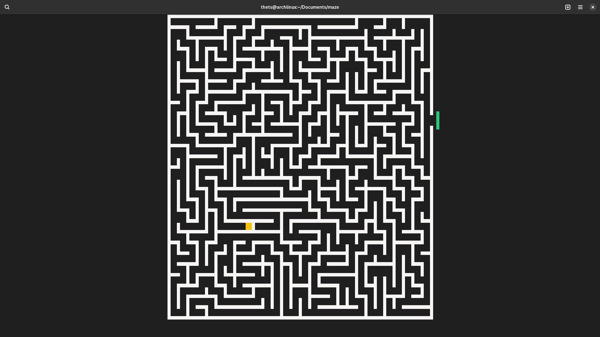
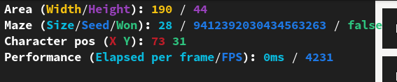

<!-- markdownlint-disable MD033 -->

# The cage



A simple (I mean really simple) TUI maze with procedurally generated maps using the DFS algorithm. The only objective of the game is to get out

## How to run

Firstly, you will need Rust installed (refer to [Rust's docs](https://www.rust-lang.org/tools/install) for instructions).

Then clone the repo:

```terminal
git clone https://github.com/TheTS-labs/the-cage.git
cd the-cage
```

And run:

```terminal
cargo run -r
```

## Controls

- <kbd>Tab</kbd> to toggle debug menu
- <kbd>Esc</kbd> to close the game
- <kbd>W</kbd>, <kbd>A</kbd>, <kbd>S</kbd>, <kbd>D</kbd> for character movement

### Debug menu



Contains some useful information about the window size, the size of the maze (in this example its 28x28 nodes) and its seed, character's position (in Pixel coordinates) and also performance counters such as FPS and time in milliseconds spend per frame

## How it works behind the scenes

Upon starting the game it picks random `u64` via `rand::thread_rng()`. Oh also, cool fact, I didn't implement inputting arbitrary seed (definitely on purpose, of course) so good luck without save files, if you close the game you will probably never find this maze ever again.
Character will start at the (random) starting point of the DFS algorithm (which I set to be only the 1/3 of the maze on the left) and the exit will be on the right on the same X level as character but flipped to make it more painful :)

Some words about winning: the maze is considered defeated not when character touches the green line, but rather by stepping on right X coordinate because you can't be there without beating the maze anyway

### Pixel coordinates

As `ratatui` uses `f64` coordinates I tried use them. Which didn't work out because terminal is still just characters after cumulative changes `f64` coordinate might be in between characters forcing to `ratatui` to choose on of them resulting in deformed shapes. So I came up with pixel coordinates, using `HalfBlocks` as marker I have practically individual "pixels" (y coordinate has double as much pixels than x because of characters being two `HalfBlocks` by the way). And definitive difference between real coordinates and pixel coordinates is in type `f64` and `u16` respectively
